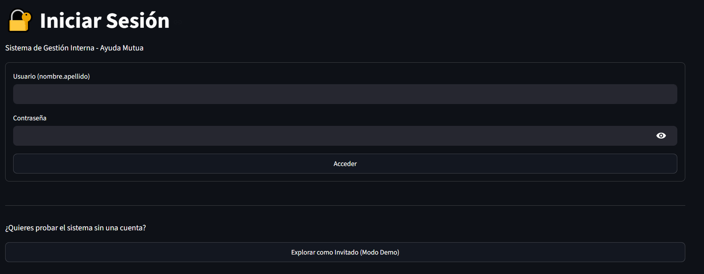

# Sistema de Gestión y Segmentación Analítica - Fundación Ayuda Mutua

Plataforma web integral desarrollada como proyecto de ingeniería de software para optimizar la gestión operativa de la Fundación Ayuda Mutua. El sistema trasciende el registro transaccional automatizando el control de donativos, e integrando análisis de datos avanzado y modelos predictivos para la toma de decisiones estratégicas en el tercer sector.

## 🚀 Características principales
* 🧠 **Segmentación con Machine Learning (K-Means):** Clasificación automática de la base de donantes (Ocasionales, Frecuentes, Grandes Donadores) analizando variables de negocio (RFM) para dirigir campañas de recaudación eficientes.
* 🔐 **Seguridad y Modo Demostración:** Sistema de autenticación conectado a base de datos con un "Modo Invitado" (Read-Only) que permite a reclutadores o usuarios externos explorar las métricas sin comprometer la integridad de los datos.
* 📊 **Dashboard Interactivo:** Visualización de KPIs en tiempo real y gráficos de dispersión interactivos renderizados con Plotly.
* 📝 **Gestión Transaccional:** Formularios robustos para el registro detallado de aportaciones y protección de llaves foráneas en bases relacionales.

## 🛠 Stack Tecnológico
* **Lenguaje:** Python
* **Framework Web:** [Streamlit](https://streamlit.io/)
* **Base de Datos & Backend:** PostgreSQL (via Supabase)
* **Ciencia de Datos & Machine Learning:** Scikit-Learn, Pandas
* **Visualización:** Plotly Express
* **Despliegue:** Streamlit Community Cloud

## 🏗 Arquitectura del Sistema
El sistema se fundamenta en un diseño robusto y escalable:
1. **Capa de Presentación:** Interfaz adaptativa (Dark/Light mode) desarrollada en Streamlit.
2. **Capa Analítica y de Negocio:** Algoritmos de clustering (Scikit-Learn), limpieza de datos y cálculos financieros en Python.
3. **Capa de Datos:** Persistencia en base de datos relacional (PostgreSQL) garantizando concurrencia, integridad referencial y seguridad de acceso.

## 📋 Estructura del Proyecto
```text
├── app.py              # Punto de entrada y renderizado de la UI/Dashboards
├── database.py         # Módulo CRUD y conexión segura a Supabase
├── requirements.txt    # Dependencias del proyecto (Pandas, Scikit-Learn, etc.)
├── .env.example        # Plantilla de variables de entorno (Credenciales)
├── assets/             # Imágenes, diagramas de arquitectura y bocetos
└── README.md
```

> 📄 **Documentación Técnica:** Para conocer los detalles del diseño arquitectónico, la validación de requisitos, diagramas de flujo y el esquema de la base de datos, consulta nuestra [Documentación Técnica (TECHNICAL_DOCS.md)](TECHNICAL_DOCS.md).

## 🚀 App desplegada

[Ayuda Mutua APP](https://ayudamutua.streamlit.app/)


## 🚀 Instalación Local
* Clona el repositorio:
```
git clone https://github.com/JorgeHdzRiv/Ayuda_Mutua_App
cd Ayuda_Mutua_App
```

* Crear un entorno virtual e instalar las dependencias:
```
python -m venv venv
# Activar en Windows: venv\Scripts\activate
# Activar en Mac/Linux: source venv/bin/activate
pip install -r requirements.txt
```

* Configura las variables de entorno: Crea un archivo .env en la raíz del proyecto y agrega tus credenciales de Supabase:
```
SUPABASE_URL="tu_url_de_supabase"
SUPABASE_KEY="tu_llave_maestra_service_role"
```

* Ejecuta la aplicación:
```
streamlit run app.py
```

Este proyecto forma parte de un portafolio profesional orientado a la Ciencia de Datos, aplicando metodologías rigurosas de manejo de información y análisis estadístico.