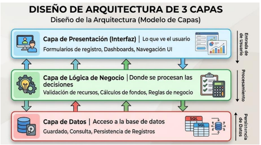
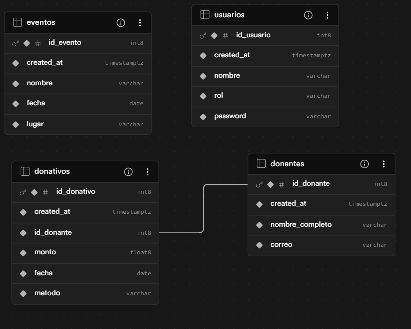

# Documentación Técnica y Arquitectura del Sistema

Este documento detalla las decisiones de ingeniería de software, la validación de requisitos y el diseño arquitectónico detrás de la plataforma de la Fundación Ayuda Mutua.

## 1. Diseño Arquitectónico
El sistema está construido bajo un patrón de arquitectura de 3 capas, asegurando la separación de responsabilidades:

* **Capa de Presentación (Frontend):** Desarrollada con Streamlit. Maneja el estado de la sesión (`st.session_state`), la inyección de CSS adaptable (Dark/Light mode) y la validación de entradas de usuario mediante expresiones regulares (Regex).
* **Capa de Lógica de Negocio (Backend):** Implementada en Python. Se encarga de procesar las credenciales, aplicar el algoritmo K-Means de Scikit-Learn para la segmentación y realizar el *Feature Engineering* (transformación de datos transaccionales en variables RFM).
* **Capa de Datos:** Alojada en Supabase (PostgreSQL). Protege la integridad de la información mediante llaves foráneas y restricciones de acceso estructuradas.

## 2. Validación de Requisitos y Seguridad
Durante la fase de diseño, se identificó la necesidad de equilibrar la demostración pública del sistema con la integridad de los datos estadísticos. 
* **Modo Demostración (Read-Only):** Se implementó un control de flujo en la UI que deshabilita las operaciones de escritura (INSERT) cuando la sesión activa corresponde al `Invitado Fundacion`. Esto previene la inyección de valores atípicos (*outliers*) que pudieran sesgar el modelo de Machine Learning.
* **Autenticación:** Las credenciales se manejan mediante variables de entorno en desarrollo local (`.env`) y a través de *Streamlit Secrets* en el entorno de producción.

## 3. Modelo de Datos (Esquema Relacional)
La base de datos está normalizada para evitar redundancias y mantener la trazabilidad institucional.

* **Tabla `usuarios`:** Gestión de acceso (ID, nombre, rol, password).
* **Tabla `donantes`:** Directorio principal (ID, nombre_completo, correo).
* **Tabla `donativos`:** Tabla transaccional vinculada a donantes mediante `id_donante` (llave foránea), registrando monto, fecha y método de pago.
* **Tabla `eventos`:** Logística de la fundación (ID, nombre, fecha, lugar).

## 4. Integración Analítica (Machine Learning)
El módulo de Análisis Avanzado no realiza consultas directas para entrenamiento; primero extrae los registros transaccionales y aplica agregaciones mediante Pandas para generar un DataFrame resumido con la Frecuencia y el Monto Total por donante. 

El modelo `KMeans(n_clusters=3)` clasifica a los usuarios basándose en estas características geométricas, y los resultados se visualizan dinámicamente mediante `plotly.express` para facilitar la interpretación de los segmentos.